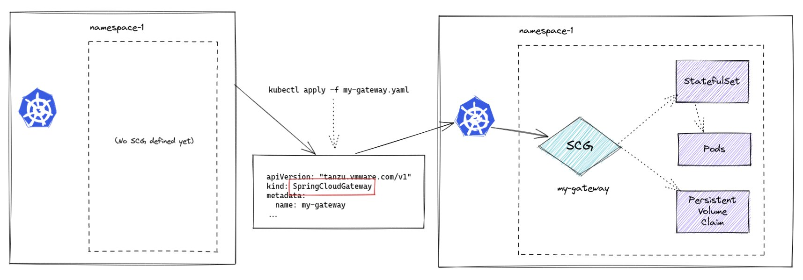

We start out with an empty namespace. We have not created anything in this namespace, and our goal for the first section is to create an instance of Spring Cloud Gateway. The way we will do this is by asking Kubernetes to do it for us by using the "Custom Resource Definitions" that have been added to the Kubernetes cluster when Spring Cloud Gateway for Kubernets (SCG4K8S) was installed.

We could have as many Spring Cloud Gateway (SCG) instances as makes sense for our organization. We are not limited to a single instance. For the purposes of this workshop, each user will create a single SCG instance.



### Validate the Namespace is Empty

To start, there will be no springcloudgateways, pods, or stateful sets in the namespace. However, once we apply the Kubernetes manifest, the SCG4K8S operator will build one for us. That way the entire life cycle of the SCG instances will be manged for us!

No SpringCloudGateway, no pods, no persistent volume claims exist (yet).

```execute-1
kubectl get deployment
```

The above command should return no resources.

```
No resources found in <your namespace> namespace.
```

### Create a Gateway Service Instance

Inspect the demo/my-gateway.yaml file it contains the YAML shown below which defines a Spring Cloud Gateway instance.

>NOTE: This will open in the online editor that is part of this workshop.

```editor:open-file
file: ~/demo/manifest-files/codebeamer-all-in-one.yaml
```

Execute the below command which will submit a request to the cluster to deploy an instance of Spring Cloud Gateway.

```execute-1
kubectl apply -f ~/demo/manifest-files/codebeamer-all-in-one.yaml
```

>NOTE: It can take a few minutes for the gateway to initially come up.

You should see a pod of the spring cloud gateway running or being launched in the cluster's default namespace as shown in the output below. Now the namespace is no longer empty and has a few Kubernetes objects being created.

```execute-1
kubectl get scg,statefulsets,pods,pvc
```

>NOTE: Don't move on until the gateway is labeled true.

You can watch the logs or describe the various objects while you are waiting, example:

```execute-2
kubectl wait --for=condition=Ready --timeout=180s pod/my-gateway-0 && kubectl logs -f my-gateway-0
```

After a couple of minutes the logs should start displaying, and the SCG's status/Readiness should be True.

```
NAME                                             READY   REASON
springcloudgateway.tanzu.vmware.com/my-gateway   True    Created
```

The gateway is now running and available.

to stop following the logs.

```terminal:interrupt
session: 2
```

